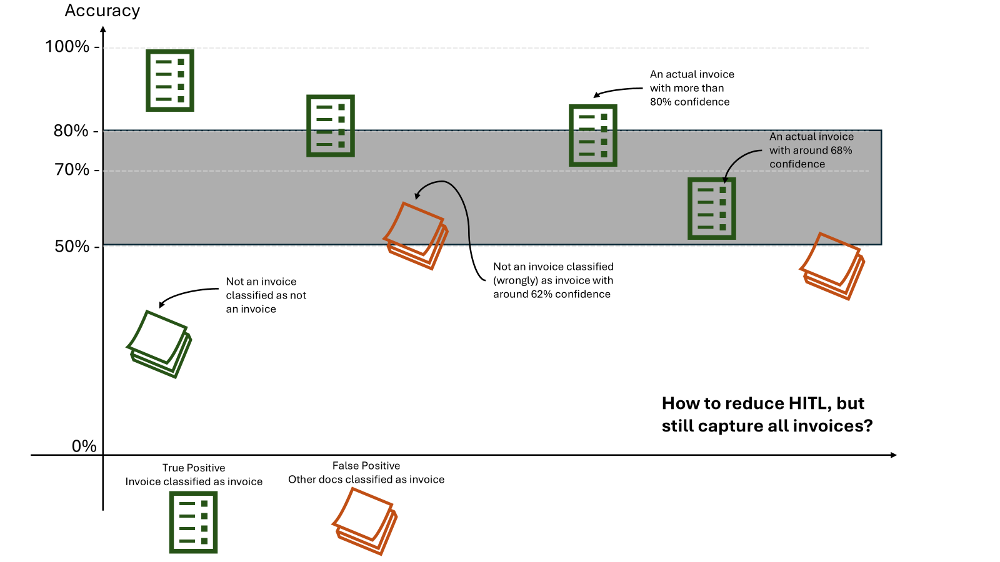
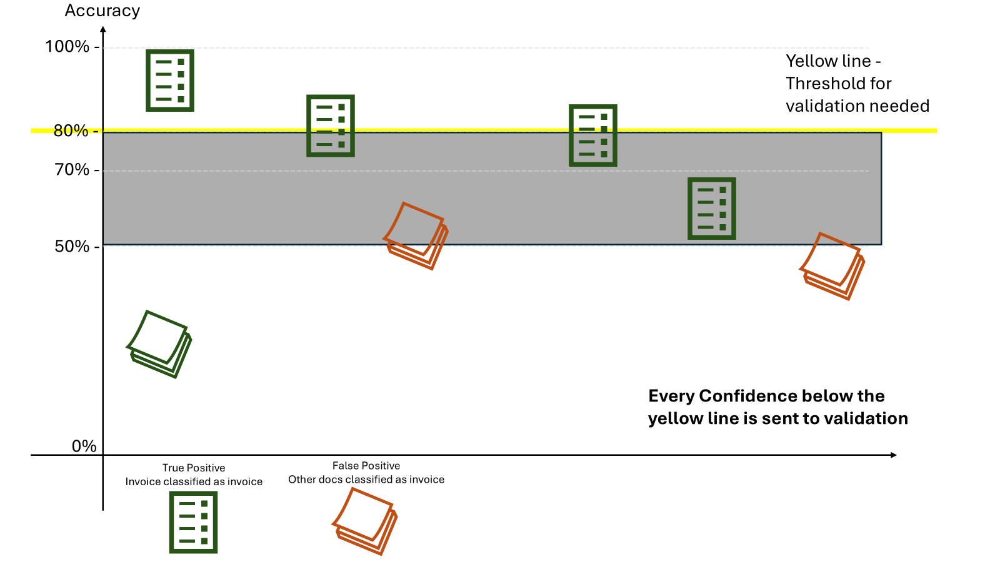
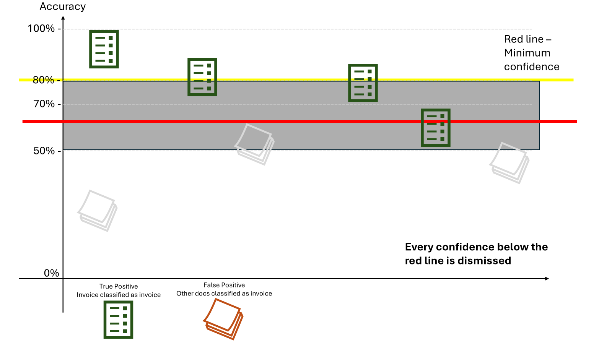
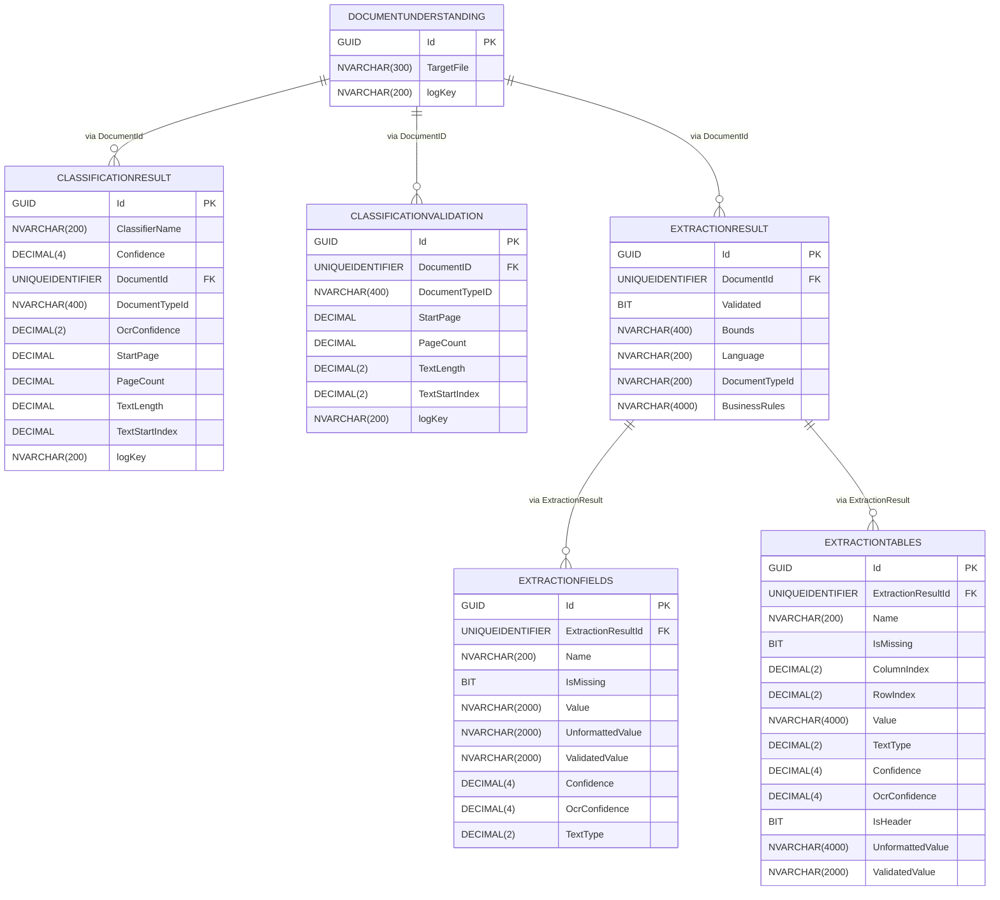

# Document Understanding Process

This is the VB.net variant of the Document Understanding Process

# License
Please check the license in the file under: DocumentUnderstandingProcess/VB/LICENSE or read below:

#### Copyright UiPath 2024

LEGAL NOTICE: 
By installing and using this software, you (individual or legal entity) agree to the applicable LICENSE AGREEMENT available here:

https://www.uipath.com/developers/all-editions/license-agreement

Please read it carefully.
If you disagree with the license agreement, do not install or use the software and delete it from your computer.

# Usage
Please see the attached User Guide and the official documentation for more details about the template and on how to get started.

# Notes

- This process you see here is a 'template' type project in UiPath Studio. As such, if you downloaded it directly from git,
it is recommended you publish it manually to a nuget or copy/paste everything in a process.

- You should be able to get this from the official feed in UiPath Studio as well, and that is the recommended way to use this.

----

# Why storing Document Understanding data?

In production, Document Understanding (DU) models use the knowledge gained during training to classify and extract information from new documents. Ideally, these models are trained with samples that reflect what they will see in production. However, document templates, layouts, or formats often change — and new document types may appear over time.

To keep models accurate, we need to track and analyze how these changes affect model performance. Storing production data allows us to:

* Identify which templates or document types cause misclassifications.
* Evaluate when retraining is necessary.
* Optimize confidence thresholds to reduce the number of Human-in-the-Loop (HITL) validations.

## Example: Optimizing Confidence Thresholds

Let’s consider a classification model. Suppose it performs reliably when the confidence is above 80%, but between 50% and 70% results vary — some classifications are correct, others not.

This gray area represents uncertainty in the model’s predictions:

To handle this effectively, we can define two thresholds: One for validation and other for the minimum confidence value.

### 1. Validation threshold
Documents with a classification confidence below this threshold are sent for human validation. For example, setting the validation threshold to 80% ensures low-confidence predictions are reviewed.

This value can be set in the Business Rules, for classification or for extraction. When the value is below the threshold, the flag to sent for validation needs to be set to True.

### 2. Minimum Confidence threshold
This threshold filters out very low-confidence classifications. If a document’s confidence is below this minimum, it will be dismissed and will not continue in the process.

Minumim confidences can be set in the Classification Document Scope or in the Data Extraction Scope activities.

### Reducinf HITL Interactions
Using these two thresholds, you can reduce HITL volume by:
* Setting the **validation threshold** higher than the **highest confidence** of any document you want to **dismiss**.
* Setting the **minimum confidence** lower than the **lowest confidence** of any document that was **correctly** classified.

Note: These values should be adjusted based on your project goals.
If your priority is to minimize human effort — even at the cost of missing some classifications — you can raise the minimum confidence threshold.

## Benefits of Data Storage
By storing Document Understanding data in a data service:
* You retain a history of model performance across document variations.
* You enable data-driven threshold tuning.
* You support continuous learning and model retraining based on real production behavior.

# Data Service implementation

Data Service was used to store Document Understanding data. It provides a structured way to persist outputs from DU workflows, enabling later analysis, reporting, and retraining.

## Entities diagram

Find the Schema for Data Service in the [Docs/Schema.json](docs/Schema.json)

## Implementation

Workflows here create or update records in Data Service. All of them were added to the `Data Service/` folder.

Each workflow starts with the same index as the `Framework/` workflow where it is called. 
So `20_DataService_Create_DocumentRecord.xaml` is called within `20_Digitize.xaml`. 

### Reporter
Reporters are the workflows that query the data service to answer specific questions.

Check out at [Reporter.md](Reporter/Reporter.md) for more details.