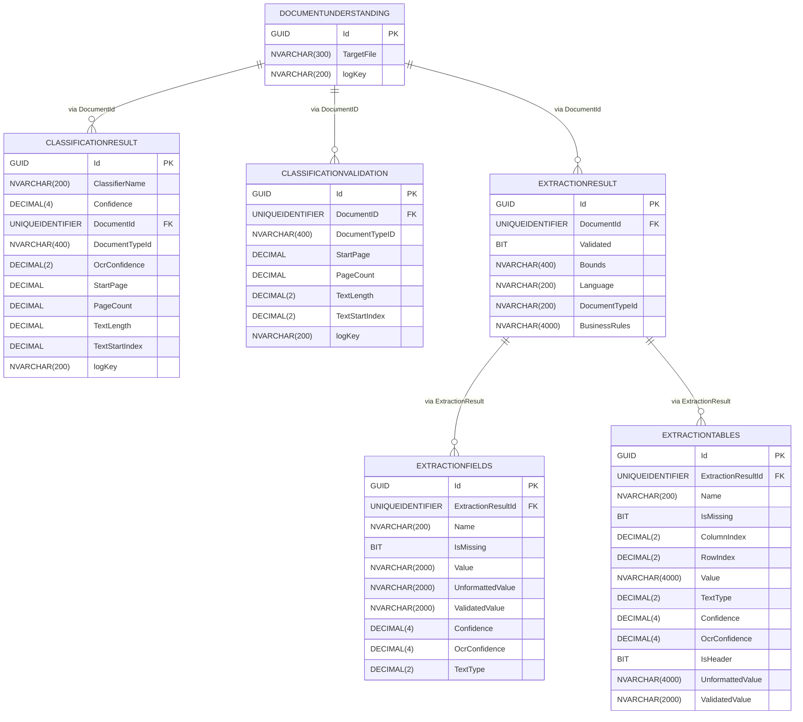

# Document Understanding Process

This is the VB.net variant of the Document Understanding Process

# License
Please check the license in the file under: DocumentUnderstandingProcess/VB/LICENSE or read below:

#### Copyright UiPath 2024

LEGAL NOTICE: 
By installing and using this software, you (individual or legal entity) agree to the applicable LICENSE AGREEMENT available here:

https://www.uipath.com/developers/all-editions/license-agreement

Please read it carefully.
If you disagree with the license agreement, do not install or use the software and delete it from your computer.

# Usage
Please see the attached User Guide and the official documentation for more details about the template and on how to get started.

# Notes

- This process you see here is a 'template' type project in UiPath Studio. As such, if you downloaded it directly from git,
it is recommended you publish it manually to a nuget or copy/paste everything in a process.

- You should be able to get this from the official feed in UiPath Studio as well, and that is the recommended way to use this.

----

# Entities diagram

